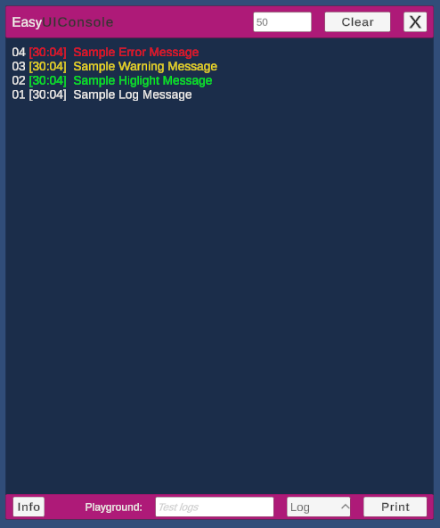
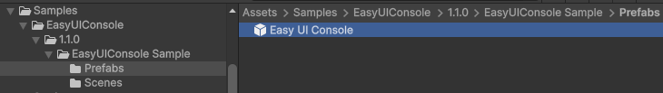

# 🖥️ EasyUIConsole for Unity




---

## 🚀 Overview

**EasyUIConsole** is a lightweight in-game console for **real-time log display** in Unity.  
It provides a clean, customizable on-screen console that shows:

- ✅ **Logs** $${\color{white}(White)}$$
- ✅ **Highlights** $${\color{green}(Green)}$$
- ✅ **Warnings** $${\color{yellow}(Yellow)}$$
- ✅ **Errors** $${\color{red}(Red)}$$

Perfect for **runtime debugging**, **mobile builds**, **playtesting**, or **live demos** where Unity’s built-in Console is not accessible.

---

## 📦 Installation

### Option A — Install via Unity Package Manager (Git URL)

1. Open **Unity → Window → Package Manager**
2. Click **+** → **Add package from Git URL**
3. Paste the following:
https://github.com/IreshSampath/unity-assets-easy-ui-console.git
4. Click **Install**

---

## 🧰 Quick Start

### ✅ Step 1 — Import Sample

1. Go to **Package Manager → EasyUIConsole → Samples**
3. Click **Import  → EasyUIConsole Sample**
4. Drag the **Easy UI Console** prefab into your scene
   


### ✅ Step 2 — Print Messages from Code

```csharp
EasyUIConsoleManager.Instance.EasyLog("Sample Log Message");
EasyUIConsoleManager.Instance.EasyHiglight("Sample Highlight Message");
EasyUIConsoleManager.Instance.EasyWarning("Sample Warning Message");
EasyUIConsoleManager.Instance.EasyError("Sample Error Message");
```

🎨 UI Behavior
Log Type	Color Style
Log	White
Highlight	Green
Warning	Yellow
Error	Red

---

## 📜 License
This project is licensed under the MIT License — free for commercial and personal use.

---

## 🙏 Thank You
Thanks for using EasyUIConsole!
- Feel free to contribute, report bugs, or request new features.

---

## 👤 Author
Iresh Sampath 🔗 [LinkedIn Profile](https://www.linkedin.com/in/ireshsampath/)
